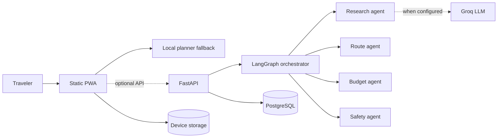

# TripMate AI

TripMate AI is an end-to-end, agentic travel-planning workspace inspired by the architecture demonstrated in [DSwithBappy's TripMate AI video](https://www.youtube.com/watch?v=rygTO5F_KWE). It is an original implementation with a production-ready offline client, an optional FastAPI/LangGraph/Groq backend, and PostgreSQL persistence.

The public app works immediately without an API key. It uses a deterministic local planner and stores trips on the device. Connecting the backend enables server-side LangGraph orchestration, Groq research, and durable multi-device storage.

## In-depth documentation

The [TripMate AI Engineering Handbook](docs/README.md) explains the project from product requirements through implementation and operations. It includes runtime and deployment diagrams, frontend state and planner internals, LangGraph/Groq orchestration, API and database contracts, PWA security, testing, CI/CD, a from-scratch build tutorial, troubleshooting runbooks, and interview questions with detailed answers.

Start with the [documentation index](docs/README.md), or jump directly to the [complete build-from-scratch guide](docs/08-build-from-scratch.md).

## Live product features

- Multi-agent trip generation with research, route, budget, and safety roles
- Day-by-day itinerary with pace-aware activity density
- Activity bookmarks, deletion, and flexible-slot insertion
- Saved trips that survive reloads
- Budget allocation, progress, and protected contingency buffer
- OpenStreetMap route view with travel-order stops
- Readiness checklist for documents, insurance, transit, and offline access
- Itinerary-aware copilot conversation surface
- Web Share API and portable JSON export
- Responsive desktop and mobile workspaces
- Installable PWA with offline shell caching
- No-key fallback mode, so the product never opens as a broken demo

## Architecture



The planner graph is deliberately sequential. Research creates the shared context, route planning consumes it, budget checks the resulting scope, and safety adds verification gates. Every run returns an `agent_trace` so behavior is inspectable instead of being a black box.

## Run the live client

The frontend has no build step and no package-registry dependency.

```bash
python -m http.server 8080
```

Open `http://localhost:8080`. Opening `index.html` directly also works, except service-worker caching is disabled on `file://` URLs.

## Run the full stack

1. Create `backend/.env` from `backend/.env.example`.
2. Add `GROQ_API_KEY` only if you want live LLM research. Never put it in browser code.
3. Start the API and PostgreSQL:

```bash
docker compose up --build
```

4. Open the API documentation at `http://localhost:8000/docs`.
5. Generate a server-side plan with `POST /api/plans/generate`.

Without `GROQ_API_KEY`, the same endpoint runs in deterministic fallback mode. Without `DATABASE_URL`, running FastAPI directly uses local SQLite.

## API example

```bash
curl -X POST http://localhost:8000/api/plans/generate \
  -H "Content-Type: application/json" \
  -d '{
    "destination": "Kyoto",
    "start_date": "2026-10-12",
    "end_date": "2026-10-16",
    "travelers": 2,
    "budget": 2400,
    "currency": "USD",
    "pace": "balanced",
    "interests": ["culture", "food", "nature"]
  }'
```

## Deployments

The workflow in `.github/workflows/deploy.yml` validates the static app and deploys it to GitHub Pages on every push to `main`.

For the optional backend, `render.yaml` defines a Docker API service and managed PostgreSQL database. In Render, create a Blueprint from this repository and provide `GROQ_API_KEY` as a secret. Set `CORS_ORIGINS` to the exact frontend origin.

## Security and reliability choices

- LLM keys remain server-side.
- User input is escaped before insertion into the static DOM.
- Trip dates, budget, party size, and payload lengths are validated by Pydantic.
- Live facts such as entry rules, weather, safety, prices, and opening times are explicitly marked for re-verification.
- CORS is allowlisted through `CORS_ORIGINS`.
- The database engine uses health checks and connection pre-ping.
- The app remains useful during model, network, or package-registry outages.

## Repository map

```text
.
|-- index.html                 # Production entry point
|-- app.js                     # UI, local agents, persistence, interactions
|-- src/styles.css             # Responsive visual system
|-- public/                    # PWA manifest, service worker, favicon
|-- backend/app/               # FastAPI, LangGraph, Groq, persistence
|-- backend/tests/             # API behavior tests
|-- docker-compose.yml         # API + PostgreSQL locally
|-- render.yaml                # Optional managed backend deployment
|-- tests/                     # Dependency-free static checks
`-- .github/workflows/         # GitHub Pages CI/CD
```

## References

- [Reference video: TripMate AI end-to-end build](https://www.youtube.com/watch?v=rygTO5F_KWE)
- [LangGraph overview](https://docs.langchain.com/oss/python/langgraph/overview)
- [FastAPI documentation](https://fastapi.tiangolo.com/)
- [Groq API documentation](https://console.groq.com/docs/overview)
- [PostgreSQL documentation](https://www.postgresql.org/docs/)

The destination artwork is generated locally by `tools/generate_assets.py`. Map embeds use OpenStreetMap.
