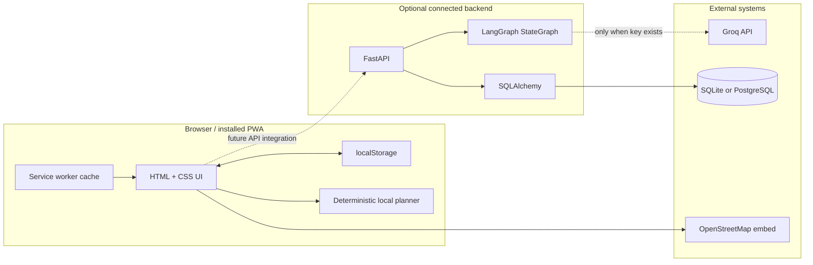
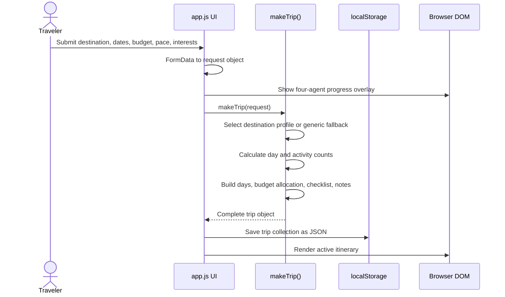
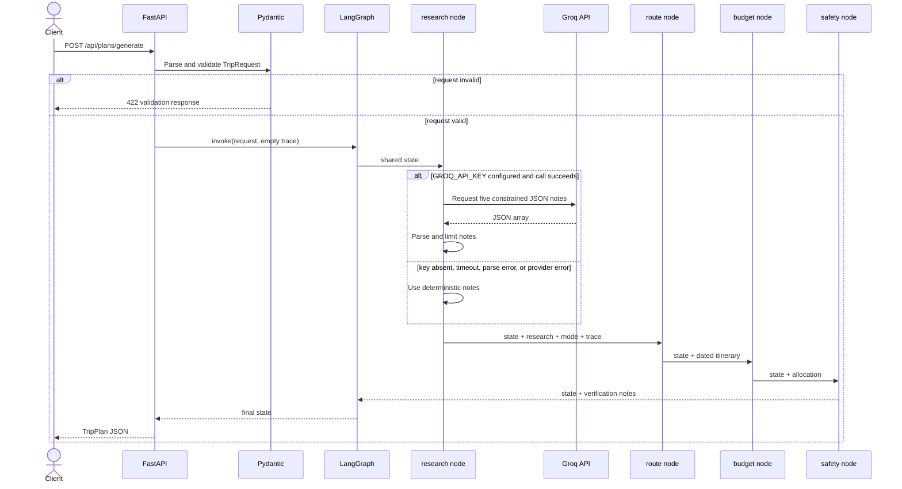
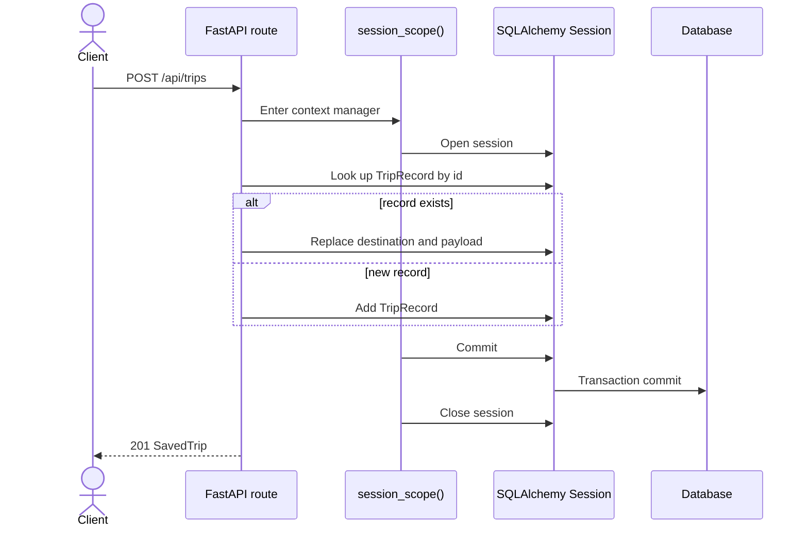
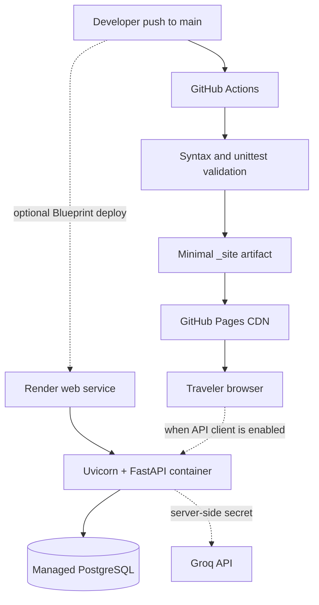

# 02. System Architecture

## 1. Architecture at a glance



The dashed browser-to-API link is important: the API is implemented and testable, but the deployed static UI currently generates and stores plans locally. A production connection would add an API client and configure its base URL at deployment time.

## 2. Component responsibilities

| Component | Owns | Does not own |
| --- | --- | --- |
| `index.html` | metadata, CSS/JS entry points, app mount node | application state or business logic |
| `app.js` | UI state, local planning, rendering, interactions, browser persistence | model keys or durable shared storage |
| `styles.css` | responsive layout, visual tokens, component states | behavior |
| `sw.js` | offline shell and runtime GET caching | private API response policy |
| FastAPI | HTTP lifecycle, CORS, validation integration, CRUD routes | browser presentation |
| LangGraph planner | ordered planning workflow and trace | HTTP concerns or SQL sessions |
| Groq integration | optional research-note generation | routing, budget math, or safety rules |
| SQLAlchemy | engine, model, transaction scope | request validation |
| GitHub Actions | validate and publish static artifact | backend hosting |
| Render blueprint | describe optional API and PostgreSQL services | frontend Pages deployment |

## 3. Static planning sequence



The progress overlay communicates the conceptual agent stages; in static mode, the result is produced by one deterministic function. This distinction should be stated honestly in demos and interviews.

## 4. Backend generation sequence



## 5. Persistence sequence



If route logic raises inside the scope, the context manager rolls the transaction back and re-raises. `finally` closes the session in both success and error paths.

## 6. Data flow and ownership

### Browser trip object

The local object is optimized for presentation. It includes image and map URLs, UI-specific activity fields, checklist completion, and agent-facing copy.

### API `TripRequest`

The input contract contains only planner inputs:

```text
destination, start_date, end_date, travelers,
budget, currency, pace, interests, notes
```

### Graph `PlannerState`

The graph progressively adds:

```text
research -> itinerary -> budget -> safety_notes
                   plus trace and execution mode
```

### API `TripPlan`

The output contract is the stable boundary returned to a connected client. It includes a generated id, summary, structured plan, safety notes, trace, and `groq` or `fallback` mode.

### Database record

The database stores:

```text
id, destination, payload JSON, created_at
```

This is a document-style persistence strategy on top of a relational database.

## 7. Failure model

| Failure | Current behavior | User impact |
| --- | --- | --- |
| Groq key absent | research node uses fixed safe notes | plan still generated |
| Groq timeout/provider error | exception is caught; trace records exception type | plan still generated |
| Groq returns invalid JSON | parsing fails into fallback | plan still generated |
| Browser storage contains invalid JSON | demo trip becomes initial state | app still launches |
| Map unavailable | itinerary and budget remain usable | map panel may not load |
| Service worker install fails | normal network application continues | no offline launch |
| Invalid API request | Pydantic/FastAPI returns 422 | no graph execution |
| Missing saved trip | API returns 404 | explicit client error |
| SQL operation fails | rollback and exception propagation | request fails without partial commit |
| Pages deployment fails validation | deployment step does not publish | previous release remains live |

## 8. Deployment topology



The frontend and backend can be released independently. This reduces coupling, but it also means API schema changes need explicit compatibility management once the browser begins calling the service.

## 9. Scaling path

The present architecture is suitable for a portfolio and small demonstration. A higher-load version would add:

1. versioned API routes such as `/api/v1`;
2. authenticated users and tenant-aware trip ownership;
3. migration tooling such as Alembic;
4. normalized activity and budget tables where analytics matter;
5. Redis for rate limits, idempotency, and short-lived job state;
6. background workers for long model/tool workflows;
7. LangGraph checkpointers for resumable threads;
8. tracing, structured logs, latency histograms, and cost metrics;
9. provider retries with bounded exponential backoff and jitter;
10. a source-aware tool layer for live travel facts;
11. API response caching keyed by normalized request and data freshness;
12. separate preview and production environments.

## 10. Architectural invariants

These rules should remain true as the project grows:

- browser code never receives model or infrastructure secrets;
- a model failure has a defined fallback or explicit recoverable error;
- live facts carry a source and freshness boundary;
- planner nodes exchange structured data rather than prose-only blobs;
- persistence commits are transactional;
- deploys validate before publication;
- the public app retains a useful no-key path.

