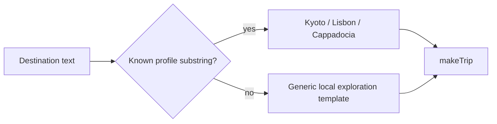
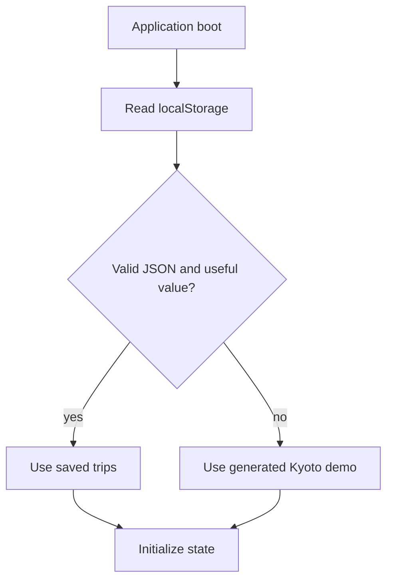

# 03. Frontend Implementation

## 1. Why a zero-build frontend

The client uses plain HTML, CSS, and JavaScript. This makes the deployment artifact obvious, avoids package-registry availability during frontend builds, and keeps the learning path focused on browser fundamentals.

The cost is equally clear: there is no static type checker, module bundler, component framework, or automatic tree shaking. If the application grows substantially, migrating the same state and component boundaries to TypeScript modules would be reasonable.

## 2. Boot process

[`index.html`](../index.html) does four things:

1. defines responsive and PWA metadata;
2. links the local manifest, favicon, and stylesheet;
3. provides one `#app` mount element;
4. loads vendored Lucide followed by `app.js`.

`app.js` is wrapped in an immediately invoked function expression:

```javascript
(function () {
  "use strict";
  // Private application scope
})();
```

This prevents internal names from leaking into the global namespace. Only the action API assigned to `window.TripMate` is globally visible because inline event handlers need it.

## 3. Local planning data

The `profiles` object contains demonstration knowledge for Kyoto, Lisbon, and Cappadocia. Each profile has:

- country and currency;
- a local hero image;
- an OpenStreetMap embed URL;
- neighborhoods used as day themes;
- activity templates with title, area, category, cost, and planning note.

Unknown destinations use the `fallback` profile. That prevents empty plans, but it does not pretend to know destination-specific facts.



## 4. Planner algorithm

`makeTrip(request)` follows a bounded pipeline:

1. `profileFor` performs a case-insensitive known-destination match.
2. `dayCount` parses local noon dates to reduce daylight-saving boundary surprises.
3. Day count is clamped to two through seven days in static mode.
4. Pace maps to two, three, or four activities per day.
5. Activity templates rotate by day and slot with modulo arithmetic.
6. Each activity receives a unique UI id, scheduled time, duration, and bookmark state.
7. Budget categories are calculated from fixed ratios that total 100%.
8. The function adds readiness checks and a concise planning explanation.

### Complexity

For `D` days and `S` slots per day, generation is `O(D * S)` in time and space. Because `D <= 7` and `S <= 4`, the upper bound is 28 activities in static mode.

### Budget invariant

```text
0.38 + 0.23 + 0.14 + 0.17 + 0.08 = 1.00
```

The final 8% is a contingency buffer, not an invitation to spend the full amount early.

## 5. State model

The browser keeps one mutable application state object:

```javascript
{
  trips,            // persisted collection
  activeId,         // selected trip
  view,             // plan | budget | map
  day,              // active day index
  sidebar,          // mobile drawer visibility
  modal,            // new-trip dialog visibility
  chat,             // copilot drawer visibility
  draftStyles       // selected interests during creation
}
```

Only `trips` is persisted. Transient navigation state is rebuilt on reload.

### Why this works here

The application has one page and a small state graph. A centralized object plus full rerender is understandable and deterministic.

### Where it stops scaling

Full `innerHTML` replacement discards DOM identity and local component state. A larger app should use DOM-diffing components or targeted updates, event delegation, and immutable state transitions.

## 6. Persistence

At startup, the client attempts to parse `localStorage["tripmate-ai-static-v1"]`. A parse error returns the demo trip rather than stopping boot.



Mutation actions call `save()` after changing the trip collection. This includes creating trips, bookmarking, removing or adding activities, and toggling checklist items.

`localStorage` is synchronous and device-local. It is appropriate for this small payload but not for cross-device sync, access control, large binary data, or concurrent writes.

## 7. Rendering model

`render()` produces the application shell from current state and assigns it to `#app`. Sub-renderers produce bounded sections:

- `tabs()` for view selection;
- `itinerary(item)` for day strip, timeline, readiness, and agent briefing;
- `budgetView(item)` for planned spend and allocation bars;
- `mapView(item)` for map and ordered stops;
- `modal()` for trip input;
- `chat(item)` for itinerary-aware assistance UI.

After rendering, `refreshIcons()` asks local Lucide to replace icon placeholders.

### Render invariant

Every action that changes visible state must either call `render()` or update a deliberately local DOM region. Most actions rerender; chat messages update only the message list.

## 8. User-input safety

Values inserted into HTML strings are passed through:

```javascript
const escapeHtml = value => String(value).replace(
  /[&<>'"]/g,
  char => ({ "&": "&amp;", "<": "&lt;", ">": "&gt;", "'": "&#39;", '"': "&quot;" })[char]
);
```

This blocks common HTML injection through destination names and chat text. It is not a general-purpose sanitizer for arbitrary trusted HTML. The design should continue to treat application data as text, not markup.

Values used inside inline JavaScript arguments are generated internally as ids rather than copied from free-form user input. If that changes, inline handlers should be replaced by `addEventListener` and data attributes.

## 9. Major interactions

### Create a trip

`submitTrip` converts `FormData` to a request, displays a progress overlay, creates the trip after a short demonstration delay, prepends it to the collection, persists, and selects it.

### Modify an itinerary

- `bookmark(id)` toggles activity saved state.
- `removeActivity(id)` filters the activity from every day.
- `addActivity()` appends a flexible slot to the active day.
- `toggleCheck(id)` updates readiness completion.

These operations modify local state immediately. A connected implementation should use optimistic updates with rollback if the server rejects the change.

### Export

`exportTrip()` serializes the active trip as formatted JSON, creates an object URL, triggers a download, then revokes the URL.

### Share

`share()` uses `navigator.share` where available and clipboard text otherwise. User cancellation is treated as a normal outcome and shown as a toast.

### Copilot surface

The current chat is a safe demonstration: it reflects itinerary context and describes a proposed editing strategy, but does not silently mutate the plan. A real copilot should return structured patch proposals and require user approval before applying them.

## 10. Responsive design

The stylesheet implements one application with layout changes rather than separate mobile markup:

- desktop shows the persistent trip sidebar and top navigation;
- small screens use a drawer, scrim, compact hero, and fixed bottom navigation;
- trip controls have stable dimensions to avoid layout shift;
- dense itinerary content remains vertically scrollable;
- text sizes are bounded and do not scale directly with viewport width.

The browser smoke test checks both functional generation and horizontal overflow. Visual QA should additionally cover 320px, 390px, 768px, 1280px, and a wide desktop viewport.

## 11. Map behavior

The map panel embeds OpenStreetMap using profile-specific bounding boxes. It visualizes context, not actual turn-by-turn routing. The stop list preserves itinerary order, which explains the intended route even if the embed fails.

For production route optimization, replace the static embed with a routing provider and retain:

- travel mode;
- route duration and distance;
- provider timestamp;
- accessibility constraints;
- fallback when a route cannot be calculated.

## 12. Connecting the frontend to the API

The smallest integration can introduce an environment-specific API base and an adapter:

```javascript
async function generateTrip(request) {
  const response = await fetch(`${API_BASE}/api/plans/generate`, {
    method: "POST",
    headers: { "Content-Type": "application/json" },
    body: JSON.stringify(toApiRequest(request))
  });
  if (!response.ok) throw new Error(`Planner failed: ${response.status}`);
  return fromApiPlan(await response.json(), request);
}
```

The adapter is necessary because the browser and API currently use different field names and presentation shapes. Do not scatter those conversions across render functions.

A robust connection should implement:

1. an `AbortController` timeout;
2. visible loading and retry states;
3. fallback to `makeTrip` on recoverable failure;
4. an indicator showing `groq`, server fallback, or local mode;
5. schema-version handling;
6. idempotency for save requests;
7. telemetry that contains no secrets or sensitive travel notes.

## 13. Frontend improvement path

1. Split planner data, state, views, and browser adapters into ES modules.
2. Add JSDoc or TypeScript types for `Trip`, `Day`, and `Activity`.
3. Replace inline handlers with delegated event listeners.
4. Add focus trapping and Escape handling for modal and chat drawers.
5. Persist an explicit data schema version and migrate old trips.
6. Use IndexedDB if payload size or offline queueing grows.
7. Add API mode with local fallback and conflict resolution.
8. Add structured copilot patch approval instead of prose-only replies.
9. Add route-provider abstraction and source freshness.
10. Add accessibility automation plus keyboard-only manual testing.

