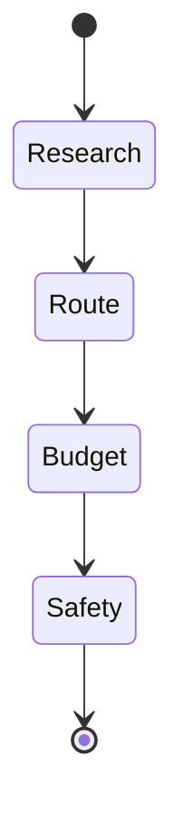
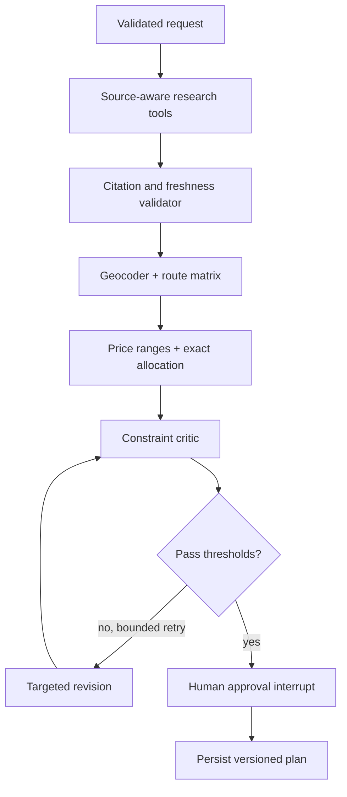

# 04. Agentic Planner

## 1. What "agentic" means in this project

TripMate uses a controlled workflow, not an unconstrained autonomous agent. The system has:

- a typed shared state;
- four named nodes with bounded responsibilities;
- explicit edges that determine execution order;
- one optional model call;
- deterministic route, budget, and safety logic;
- a trace of node outcomes;
- a fallback path for every model failure.

That design is intentionally closer to a state machine than to an open-ended chatbot. It is easier to test, explain, and operate.

## 2. LangGraph concepts used

LangGraph's Graph API is built around **state**, **nodes**, and **edges**. In TripMate:

- `PlannerState` is the state schema;
- Python functions such as `research_agent` are nodes;
- `add_edge` calls create the fixed sequence;
- `compile()` validates and produces the invokable graph;
- `planner_graph.invoke(...)` runs one planning request.

See [`backend/app/planner.py`](../backend/app/planner.py).

## 3. Shared state

```python
class PlannerState(TypedDict, total=False):
    request: TripRequest
    research: list[str]
    itinerary: list[dict]
    budget: dict
    safety_notes: list[str]
    trace: list[dict]
    mode: str
```

`total=False` permits the graph to start with only `request` and `trace`; later nodes add their outputs. The practical contract is still strict: a downstream node assumes every required upstream value exists.

### State evolution

| Step | Reads | Adds or updates |
| --- | --- | --- |
| Invocation | client request | `request`, empty `trace` |
| Research | `request` | `research`, `mode`, `trace` |
| Route | `request` | `itinerary`, `trace` |
| Budget | `request` | `budget`, `trace` |
| Safety | current state | `safety_notes`, `trace` |
| Output mapping | final state and request | validated `TripPlan` |

Each node returns only its updates. LangGraph merges those updates into shared state.

## 4. Graph topology



The implementation is:

```python
graph = StateGraph(PlannerState)
graph.add_node("research", research_agent)
graph.add_node("route", route_agent)
graph.add_node("budget", budget_agent)
graph.add_node("safety", safety_agent)
graph.add_edge(START, "research")
graph.add_edge("research", "route")
graph.add_edge("route", "budget")
graph.add_edge("budget", "safety")
graph.add_edge("safety", END)
planner_graph = graph.compile()
```

Why sequential? Route planning conceptually depends on destination research, budget checks the schedule's scope, and safety is a final gate. The current route node does not yet consume research notes, so the data dependency is architectural intent rather than a full implementation. That is a useful extension point.

## 5. Trace design

`trace` appends concise execution metadata:

```python
def trace(state, agent, output):
    return [*state.get("trace", []), {"agent": agent, "output": output}]
```

Example:

```json
[
  {"agent": "research", "output": "Used deterministic destination research."},
  {"agent": "route", "output": "Built 4 days at a balanced pace."},
  {"agent": "budget", "output": "Allocated the full budget with an 8% reserve."},
  {"agent": "safety", "output": "Added live-fact checks and offline readiness."}
]
```

This is an audit-oriented event summary. Do not store private model reasoning or sensitive prompt content in traces.

## 6. Research node and Groq integration

The research node always starts by preparing three conservative fallback notes. It then checks `GROQ_API_KEY`.

### No key

The node returns fallback notes, records `mode = "fallback"`, and makes no network request.

### Key configured

The node imports `ChatGroq` lazily, configures the model from environment variables, and asks for exactly five concise JSON notes.

```python
model = ChatGroq(
    api_key=api_key,
    model=os.getenv("GROQ_MODEL", "llama-3.3-70b-versatile"),
    temperature=0.2,
    timeout=float(os.getenv("GROQ_TIMEOUT_SECONDS", "15")),
    max_retries=0,
)
```

The low temperature reduces output variability. A short timeout bounds request latency. Library retries are disabled because this version prefers immediate fallback over multiplying latency.

### Output parsing

The response is treated as untrusted data:

1. convert content to text;
2. strip a possible JSON code fence;
3. parse with `json.loads`;
4. require a list;
5. coerce entries to strings;
6. keep at most five notes.

Any import, network, timeout, provider, or parse error enters the same fallback path. The trace stores only the exception class, limiting accidental disclosure.

### Why not let the model build the full trip?

Budget arithmetic and schedule shape have deterministic rules. Keeping those in code provides:

- repeatable outputs;
- guaranteed total allocation;
- predictable latency;
- simpler tests;
- lower token use;
- a smaller prompt-injection surface.

The model is used where flexible synthesis adds value: research-oriented context.

## 7. Route node

The route node calculates inclusive day count:

```text
(end_date - start_date).days + 1
```

It maps pace to activity density:

| Pace | Slots per day |
| --- | ---: |
| easy | 2 |
| balanced | 3 |
| packed | 4 |

Four generic templates rotate across days. Every day gets an ISO date, theme, and timed activities. Input validation limits requests to fourteen days, so the maximum output is 56 activities.

Current limitation: this node generates a structurally useful plan but does not geocode, calculate travel times, or rank real venues. A production route node should consume sourced candidate places and a route-matrix tool.

## 8. Budget node

The budget node applies the same fixed allocation used by the browser:

```python
ratios = {
    "stay": 0.38,
    "food": 0.23,
    "local_travel": 0.14,
    "experiences": 0.17,
    "buffer": 0.08,
}
```

Each category is rounded to two decimals. Per-category rounding can make the sum differ from the input by a few cents for some values. A financial production implementation should assign the rounding remainder to the buffer so the exact invariant holds.

## 9. Safety node

The safety node adds process safeguards, not live claims:

- verify government entry rules and advisories before purchase;
- recheck weather, closures, transit, and hours shortly before each day;
- keep emergency contacts, insurance, and first-night address offline.

This is a deliberate boundary. Without a sourced live-data tool, the planner should instruct verification rather than invent current safety facts.

## 10. Output mapping

`plan_trip` invokes the compiled graph and constructs a Pydantic `TripPlan`. That final construction validates the response shape before FastAPI serializes it.

The id uses twelve hexadecimal characters from a UUID. This is adequate for a demo identifier, though database-side UUIDs and ownership constraints are preferable in a multi-user system.

## 11. Determinism and failure semantics

| Area | Deterministic? | Failure behavior |
| --- | --- | --- |
| Input validation | yes | request rejected before graph |
| Research with no key | yes | safe fallback |
| Research with Groq | no | malformed/error falls back |
| Route | yes | fails only on unexpected program error |
| Budget | yes | validated positive budget |
| Safety | yes | fixed verification guidance |
| Final schema | yes | construction error exposes implementation defect |

## 12. Testing the planner

The current API test verifies fallback mode, day count, and buffer allocation. A fuller planner suite should add:

1. easy, balanced, and packed slot counts;
2. one-day and fourteen-day boundaries;
3. invalid reversed dates and fifteen-day requests;
4. exact budget allocation and rounding behavior;
5. mocked Groq success with valid JSON;
6. mocked timeout, provider error, invalid JSON, and wrong JSON type;
7. trace order and mode;
8. schema validity for every output;
9. prompt-injection-like text in destination, interests, and notes;
10. property-based checks that every activity date is in range.

## 13. Evaluation strategy

Traditional tests show whether the workflow obeys contracts. Model quality needs a separate evaluation set.

Create a versioned dataset containing destinations, constraints, and expected properties. Score outputs on:

- constraint satisfaction;
- geographic coherence;
- pace realism;
- diversity without duplication;
- budget plausibility;
- unsupported live claims;
- clarity of verification warnings;
- latency, tokens, and provider cost.

Use human review for subjective dimensions and deterministic validators for dates, budget, duplication, and schema.

## 14. Production evolution



For a mature implementation, add a LangGraph checkpointer, per-request thread id, bounded conditional retries, tool-specific timeouts, idempotent nodes, and resumable human approval. Keep the deterministic fallback as a first-class route, not dead code.

## 15. Authoritative reading

- [LangGraph overview](https://docs.langchain.com/oss/python/langgraph/overview)
- [LangGraph Graph API](https://docs.langchain.com/oss/python/langgraph/graph-api)
- [Thinking in LangGraph](https://docs.langchain.com/oss/python/langgraph/thinking-in-langgraph)
- [Groq API overview](https://console.groq.com/docs/overview)

