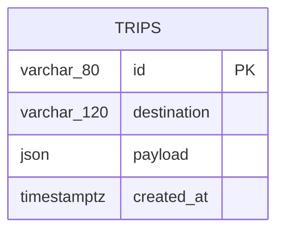
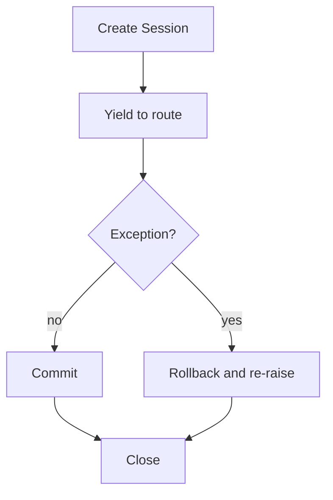

# 05. API and Data Layer

## 1. HTTP service structure

[`backend/app/main.py`](../backend/app/main.py) creates one FastAPI application with:

- a lifespan hook for database initialization;
- an allowlisted CORS middleware;
- a health route;
- one planner route;
- four saved-trip CRUD routes.

FastAPI uses Pydantic models for request parsing, validation, response filtering, and generated OpenAPI documentation.

## 2. Application lifespan

```python
@asynccontextmanager
async def lifespan(_: FastAPI):
    initialize_database()
    yield
```

Before the application accepts requests, `initialize_database()` calls `Base.metadata.create_all(engine)`. This is convenient for a demonstration, but it is not a schema migration strategy. Production changes should use Alembic migrations applied during release.

## 3. CORS boundary

Allowed origins come from a comma-separated `CORS_ORIGINS` environment variable. The default is `http://localhost:8080`.

```python
origins = [
    origin.strip()
    for origin in os.getenv("CORS_ORIGINS", "http://localhost:8080").split(",")
    if origin.strip()
]
```

The middleware allows only `GET`, `POST`, and `DELETE`, only the `Content-Type` request header, and no credentialed cross-origin cookies.

CORS is a browser policy, not authentication. A production API still needs identity, authorization, rate limits, and ownership checks.

## 4. Request schema

[`backend/app/schemas.py`](../backend/app/schemas.py) defines `TripRequest`:

| Field | Rule | Why |
| --- | --- | --- |
| `destination` | 2 to 120 characters | block empty and unbounded text |
| `start_date` | ISO-compatible date | stable date semantics |
| `end_date` | ISO-compatible date | stable date semantics |
| `travelers` | 1 to 12 | bound plan scope |
| `budget` | greater than 0, max 1,000,000 | prevent nonsensical and extreme values |
| `currency` | exactly 3 characters | ISO-style currency representation |
| `pace` | easy, balanced, or packed | closed planner behavior |
| `interests` | at most 10 strings | bound prompt and response scope |
| `notes` | at most 2,000 characters | bound model input |

A model-level validator enforces:

- end date cannot precede start date;
- inclusive trip duration cannot exceed fourteen days.

Potential improvement: constrain individual interest lengths and normalize currency to uppercase during validation.

## 5. Response schemas

### `TripPlan`

Returns generated itinerary, budget, safety notes, execution trace, and mode. The nested itinerary and budget currently use generic `dict` values. This is flexible but weakens OpenAPI and validation.

A production schema should define `Activity`, `ItineraryDay`, `BudgetAllocation`, and `AgentTraceEvent` models explicitly.

### `SavedTrip`

Contains id, destination, and an arbitrary JSON payload. This matches the document-style database strategy.

Potential improvement: add `schema_version`, `user_id`, timestamps, and optimistic concurrency version.

## 6. Endpoint reference

### Health

```http
GET /health
```

Response:

```json
{"status":"ok","planner_mode":"fallback"}
```

This is a process-readiness signal. It does not currently verify database connectivity or a live Groq request.

### Generate plan

```http
POST /api/plans/generate
Content-Type: application/json
```

Example body:

```json
{
  "destination": "Kyoto",
  "start_date": "2026-10-12",
  "end_date": "2026-10-16",
  "travelers": 2,
  "budget": 2400,
  "currency": "USD",
  "pace": "balanced",
  "interests": ["culture", "food", "nature"],
  "notes": "Avoid very early starts after arrival day."
}
```

Success is `200` with `TripPlan`. Validation failures are `422` with structured details.

### Save or replace trip

```http
POST /api/trips
```

If the id exists, destination and payload are replaced. Otherwise, a new record is inserted. The route returns `201` in both cases, so its semantics are closer to an upsert than a strict create.

For clearer REST semantics, use `PUT /api/trips/{id}` for idempotent replacement and reserve `POST /api/trips` for server-generated ids.

### List trips

```http
GET /api/trips
```

Records are ordered by creation time descending. There is no pagination yet.

### Fetch one trip

```http
GET /api/trips/{trip_id}
```

Returns `404 {"detail":"Trip not found"}` when absent.

### Delete one trip

```http
DELETE /api/trips/{trip_id}
```

Returns `204 No Content` on success and `404` when absent.

## 7. Database URL normalization

[`backend/app/database.py`](../backend/app/database.py) defaults to local SQLite:

```text
sqlite:///./tripmate.db
```

Hosted platforms sometimes supply `postgres://` or `postgresql://`. The code rewrites either prefix to `postgresql+psycopg://` so SQLAlchemy uses the installed Psycopg 3 driver.

SQLite receives `check_same_thread=False` because FastAPI request handling may access connections across worker threads. PostgreSQL uses normal pool settings plus `pool_pre_ping=True` to detect stale pooled connections before use.

## 8. ORM model



`destination` has an index. `payload` is native JSON where supported. `created_at` uses an application-side UTC default.

### Benefits of the JSON payload

- frontend plan shape can evolve quickly;
- one read restores a complete plan;
- unknown optional fields survive persistence;
- initial implementation remains small.

### Costs

- relational constraints cannot validate nested activity data;
- querying budget or activity fields is database-specific;
- partial updates rewrite the payload;
- schema migrations move into application code;
- payload indexes require deliberate JSON indexing.

## 9. Transaction scope

```python
@contextmanager
def session_scope():
    session = Session(engine)
    try:
        yield session
        session.commit()
    except Exception:
        session.rollback()
        raise
    finally:
        session.close()
```

The request route controls operations while the context manager controls resource and transaction lifecycle.



This prevents leaked sessions and partial commits. It does not automatically retry serialization failures or connection outages.

## 10. Local execution

From the repository root:

```bash
python -m venv .venv
.venv\Scripts\Activate.ps1
pip install -r backend/requirements.txt -r backend/requirements-dev.txt
uvicorn backend.app.main:app --reload --port 8000
```

With no `DATABASE_URL`, the API creates `tripmate.db` in the current working directory. With no `GROQ_API_KEY`, generation uses fallback mode.

Useful URLs:

- `http://localhost:8000/health`
- `http://localhost:8000/docs`
- `http://localhost:8000/redoc`
- `http://localhost:8000/openapi.json`

## 11. Docker Compose execution

Copy the environment template, leaving the model key empty if desired:

```powershell
Copy-Item backend/.env.example backend/.env
docker compose up --build
```

The PostgreSQL health check must pass before the API starts. The named volume `tripmate_data` preserves database files across container recreation.

The API container installs requirements in a Python 3.12 slim image, copies only `backend/app`, exposes port 8000, and launches Uvicorn.

## 12. API testing examples

PowerShell:

```powershell
$body = @{
  destination = "Lisbon"
  start_date = "2026-11-05"
  end_date = "2026-11-09"
  travelers = 2
  budget = 2200
  currency = "EUR"
  pace = "balanced"
  interests = @("food", "culture")
} | ConvertTo-Json

Invoke-RestMethod `
  -Uri http://localhost:8000/api/plans/generate `
  -Method Post `
  -ContentType application/json `
  -Body $body
```

curl:

```bash
curl -X POST http://localhost:8000/api/plans/generate \
  -H "Content-Type: application/json" \
  --data @request.json
```

## 13. Production data concerns

Before supporting real users, add:

1. authentication and per-user authorization on every trip route;
2. UUID or sortable unique identifiers generated server-side;
3. Alembic migration history;
4. pagination and bounded result sizes;
5. request ids and structured error envelopes;
6. idempotency keys for plan generation and writes;
7. payload schema version and migration logic;
8. database statement and request timeouts;
9. encrypted backups and retention policy;
10. deletion/export workflows for user data;
11. connection pool sizing per process and database limits;
12. health separation: liveness, readiness, and dependency diagnostics.

## 14. Authoritative reading

- [FastAPI documentation](https://fastapi.tiangolo.com/)
- [SQLAlchemy transaction management](https://docs.sqlalchemy.org/en/20/orm/session_transaction.html)
- [PostgreSQL documentation](https://www.postgresql.org/docs/)
- [Docker Compose documentation](https://docs.docker.com/compose/)

