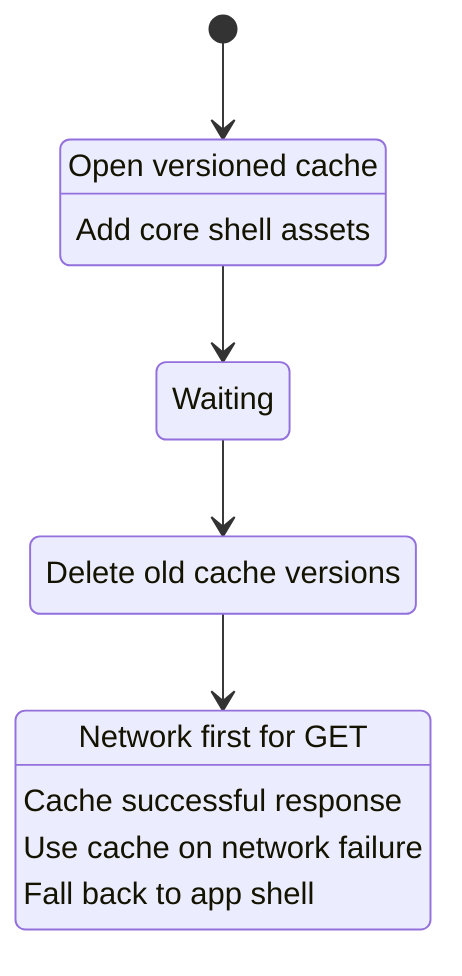
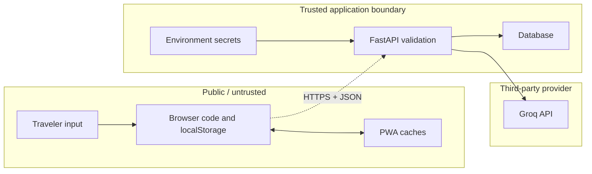
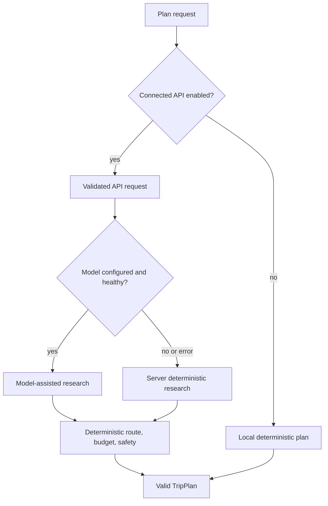

# 06. PWA, Security, and Reliability

## 1. PWA pieces

TripMate becomes installable and offline-capable through three coordinated pieces:

1. [`public/manifest.webmanifest`](../public/manifest.webmanifest) provides app identity, colors, icon, display mode, start URL, and scope.
2. [`sw.js`](../sw.js) owns installation, cache cleanup, and GET request handling.
3. `app.js` registers the service worker after the window `load` event when the page uses HTTP or HTTPS.

Service workers are unavailable for ordinary `file://` execution. Use a local HTTP server when testing installation or offline behavior.

## 2. Portable GitHub Pages scope

A project Pages site is hosted under a subpath. Hard-coding `/app.js` would request the account root instead of `/tripmate-ai/app.js`.

The manifest therefore uses:

```json
{"start_url":"../","scope":"../"}
```

The service worker derives its base path from its registration scope:

```javascript
const BASE = new URL(self.registration.scope).pathname.replace(/\/$/, "");
const asset = path => `${BASE}/${path}`;
```

This supports both root hosting and project-subpath hosting.

## 3. Cache lifecycle



### Install

The worker opens `tripmate-ai-v2` and precaches HTML scope, JavaScript, CSS, manifest, icon library, icon, and images. If a required asset fails, installation fails and the previous worker remains active.

### Activate

All cache names except the current version are deleted.

### Fetch

Only GET requests are intercepted. The strategy is network first:

1. attempt the network;
2. clone and cache the response;
3. if network fails, look for the exact cached request;
4. if not found, return the cached app shell.

This keeps content fresh when online and usable when offline.

## 4. Cache limitations

The generic app-shell fallback can return HTML for a missing non-navigation request. A stronger implementation should inspect `event.request.mode === "navigate"` before returning HTML.

Other production improvements:

- cache only successful and acceptable response types;
- do not cache authenticated API responses by default;
- cap runtime cache size and age;
- provide an offline page for uncached destinations;
- notify users when a new worker is waiting;
- call `skipWaiting` only with an intentional update experience;
- version cached data independently from code assets.

## 5. Security boundaries



Everything in browser source, storage, network tools, and caches is visible to the user. No credential belongs there.

## 6. Secret management

`backend/.env.example` contains names and safe defaults, not a real key. `backend/.env` is ignored by Git.

Rules:

- keep `GROQ_API_KEY` only in the process environment or hosting secret store;
- never commit personal access tokens or model keys;
- never include them in frontend requests, logs, traces, test fixtures, or screenshots;
- use least-privilege, time-limited credentials where possible;
- rotate immediately after accidental disclosure;
- enable repository and CI secret scanning;
- avoid shell history exposure when setting secrets interactively.

The static test scans `app.js` for common GitHub and Groq token prefixes. It is a useful guardrail, not a complete secret scanner.

## 7. Threat model

| Threat | Current control | Remaining work |
| --- | --- | --- |
| HTML injection through trip text | `escapeHtml` before template insertion | remove inline handlers; add CSP |
| API input abuse | Pydantic lengths, ranges, enums | request size limits, rate limits, WAF |
| Stolen model key | server-only environment variable | managed secrets, rotation, provider quotas |
| Unauthorized trip access | none in demo | authentication and ownership authorization |
| Cross-origin browser calls | CORS allowlist | CORS is not auth; add access control |
| Prompt injection in notes | narrow prompt and model scope | content separation, tool allowlists, output policy |
| Malicious model output | JSON parse, list check, string coercion | item length limits and content validation |
| Dependency compromise | version ranges, small dependency set | lock files, vulnerability scanning, provenance |
| Stale offline code | versioned cache | controlled update notification |
| Sensitive local data | device-only localStorage | user warning, clear-data control, encryption strategy |
| Database injection | ORM operations | continue avoiding raw string SQL |
| Resource exhaustion | bounded trip inputs | API rate limits, timeouts, quotas, concurrency controls |

## 8. Prompt-injection analysis

Traveler fields are interpolated into a model prompt. A user could place instructions inside destination, interests, or notes. In the current design, blast radius is limited because:

- the model has no tools;
- it cannot access the database or environment;
- its output must parse as a list;
- only five strings are retained;
- route, budget, and safety logic remain deterministic.

Still, output strings can contain misleading content. A production system should:

1. mark user data as data in a structured prompt;
2. use structured output/schema support where available;
3. cap each output string length;
4. run factual and policy validators;
5. attach source ids and timestamps to live facts;
6. never execute model output as code or SQL;
7. require approval before external side effects.

## 9. Reliability strategy

TripMate uses graceful degradation:



The system has three potential service levels: local fallback, server fallback, and model-assisted. The user should be told which one produced the result.

## 10. Timeout and retry policy

The model call has a configurable timeout and no automatic retry. This is appropriate for a synchronous demonstration that values bounded latency.

A production policy should distinguish:

- invalid request: never retry;
- authentication or quota failure: do not blindly retry;
- timeout, 429, or transient 5xx: retry a small number of times with exponential backoff and jitter;
- parse failure: one constrained repair attempt may be allowed;
- database serialization conflict: retry the transaction if operation is idempotent;
- client disconnect: cancel downstream work where possible.

Every retry needs a total deadline and idempotency strategy.

## 11. Privacy considerations

Travel dates, destinations, party details, and notes can be sensitive. The current static mode keeps data on the device, but browser storage is readable by scripts running on the same origin.

Before production:

- publish a clear data policy;
- collect only necessary fields;
- avoid putting sensitive details in model prompts;
- define retention and deletion windows;
- encrypt transport and managed storage;
- prevent private data from entering analytics or error traces;
- provide export and deletion controls;
- document third-party model processing.

## 12. Observability plan

Useful server signals:

- request count, status, and latency by route;
- plan success rate by mode;
- model latency, errors, tokens, and cost;
- fallback reason categories;
- graph node duration;
- database pool and transaction errors;
- deployment version and schema version.

Use request ids to correlate API logs, graph events, and database operations. Do not log raw notes or keys. Measure user outcomes with consent and data minimization.

## 13. Security verification checklist

1. Search the entire repository and history for credential patterns.
2. Confirm `.env` is ignored and absent from the commit.
3. Verify CORS includes only intended frontend origins.
4. Test HTML-like destination and notes input.
5. Send overlong and out-of-range API fields.
6. Confirm unauthorized routes fail once authentication is added.
7. Inspect service-worker caches for sensitive responses.
8. Run dependency and container vulnerability scans.
9. Add secure response headers, especially CSP and `X-Content-Type-Options`.
10. Verify key rotation and incident response procedures.

## 14. Authoritative reading

- [MDN Service Worker API](https://developer.mozilla.org/en-US/docs/Web/API/Service_Worker_API)
- [MDN Progressive web apps](https://developer.mozilla.org/en-US/docs/Web/Progressive_web_apps)
- [FastAPI CORS guide](https://fastapi.tiangolo.com/tutorial/cors/)
- [OWASP API Security Top 10](https://owasp.org/API-Security/)

