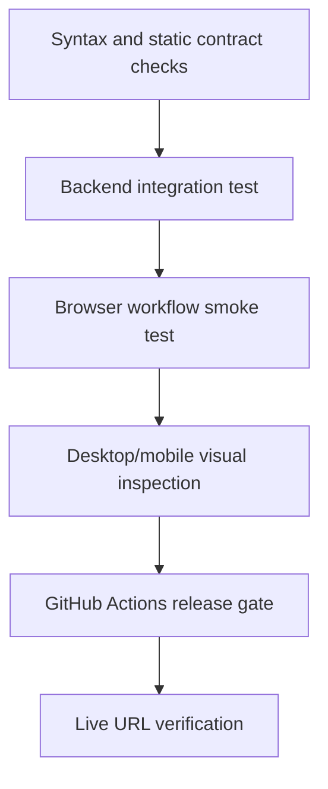
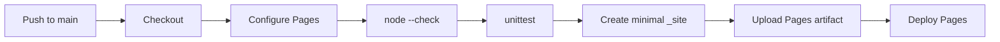

# 07. Testing, CI/CD, and Deployment

## 1. Verification strategy

TripMate uses several small layers of verification because no single test style catches every failure:



The repository keeps release-gating frontend tests dependency-free so GitHub Pages deployment is not blocked by package installation.

## 2. Static JavaScript validation

Run:

```bash
node --check app.js
```

This catches syntax errors before a browser tries to execute the file. It does not type-check values or run the application.

## 3. Dependency-free site tests

[`tests/test_static_site.py`](../tests/test_static_site.py) uses Python's standard `unittest` package.

```bash
python -m unittest discover -s tests -v
```

The tests verify:

1. HTML references the expected JavaScript and CSS files.
2. Those files exist.
3. The manifest is valid JSON, uses standalone display, and has a Pages-compatible start URL.
4. Core user workflows are present in browser code.
5. common GitHub and Groq credential prefixes do not appear in `app.js`.

These are contract checks, not full behavioral tests. Their value is speed and zero external dependencies.

## 4. Backend integration test

[`backend/tests/test_api.py`](../backend/tests/test_api.py) uses FastAPI's test client and pytest.

Run the test with `backend` as the working directory because the test imports the package as `app`:

```powershell
Push-Location backend
..\.venv\Scripts\python.exe -m pytest tests -q
Pop-Location
```

The test explicitly removes `GROQ_API_KEY`, starts the application lifespan, checks `/health`, posts a four-day request, and asserts:

- HTTP success;
- fallback planner mode;
- four itinerary days;
- an 8% buffer of 192 for a 2,400 budget.

This test crosses HTTP routing, Pydantic validation, graph execution, and response serialization. It deliberately avoids a live model call so it is deterministic.

### Important isolation note

The application engine is created when the database module is imported. The `tmp_path` fixture is currently unused, so the test may create a local SQLite file depending on the working directory. Better isolation would set `DATABASE_URL` before importing the app or use dependency injection for the session factory.

## 5. Browser smoke test

[`tools/browser_smoke.py`](../tools/browser_smoke.py) drives a real browser against the local site. It verifies the initial workspace and generates another trip through the modal.

A typical run needs the static server first:

```bash
python -m http.server 8080
python tools/browser_smoke.py
```

Expected properties include:

- correct title and destination heading;
- initial activity cards present;
- no horizontal overflow;
- new destination appears after generation;
- saved-trip count increases;
- generated itinerary contains activities.

The smoke test checks user-observable behavior that source scanning cannot.

## 6. Manual browser test matrix

| Area | Test |
| --- | --- |
| Creation | valid known destination, unknown destination, each pace, min/max budget |
| Date handling | same day, reversed dates, daylight-saving boundary, missing date |
| State | reload, select trip, delete activities, bookmark, checklist toggles |
| Export | downloaded JSON parses and contains active trip |
| Share | Web Share path and clipboard fallback |
| Offline | first online visit, offline reload, uncached request behavior |
| Responsive | 320px, 390px, 768px, 1280px, wide desktop |
| Keyboard | tab order, modal controls, focus visibility, action activation |
| Failure | blocked map, denied clipboard, disabled storage, service-worker error |
| Content safety | destination containing `<script>` and quote characters |

## 7. Suggested expanded test pyramid

### Unit tests

- `dayCount` boundaries;
- `profileFor` matching;
- budget ratio invariant;
- local planner output shape;
- Pydantic field and date rules;
- every LangGraph node in isolation;
- database URL normalization.

### Integration tests

- all API CRUD routes against a temporary database;
- rollback after a forced SQL exception;
- mocked Groq success and all fallback causes;
- CORS preflight from allowed and denied origins;
- service-worker cache list matching deployed artifact.

### End-to-end tests

- create, modify, save, reload, export;
- connected API generation and local fallback;
- responsive navigation and drawers;
- offline launch after warm cache;
- Pages subpath routing.

### Non-functional tests

- accessibility scan and keyboard review;
- Lighthouse PWA/performance run;
- API load test with model mocked;
- model quality evaluation dataset;
- dependency, secret, and container scans.

## 8. GitHub Actions workflow

[`.github/workflows/deploy.yml`](../.github/workflows/deploy.yml) runs on pushes to `main` and manual dispatch.



### Permissions

- `contents: read` permits checkout.
- `pages: write` permits Pages deployment.
- `id-token: write` supports the deployment's OIDC token.

### Concurrency

All runs use the `pages` concurrency group with `cancel-in-progress: true`. A newer main-branch push supersedes an older deployment still running.

### Minimal artifact

The workflow stages only runtime files into `_site`:

- `index.html`, `app.js`, `sw.js`;
- stylesheet;
- manifest, icon library, favicon, and JPEG assets;
- `.nojekyll`.

Backend code, tests, docs, and local tooling are not exposed as website files.

## 9. Why validation precedes deployment

GitHub Pages deployment occurs only after syntax and contract checks succeed. If validation fails, the current live version remains in place.

This is continuous delivery because every validated main-branch commit is published automatically. It is not a full production pipeline yet because it lacks preview environments, approval gates, release notes, rollback automation, and post-deploy functional tests.

## 10. GitHub Pages setup

1. Push the repository to GitHub.
2. Open repository **Settings > Pages**.
3. Select **GitHub Actions** as the source.
4. Push to `main` or run the workflow manually.
5. Inspect the workflow run and deployment environment.
6. Open the emitted Pages URL.
7. Hard-refresh once when checking a service-worker update.

The project is live at [TripMate AI](https://anishhar03.github.io/tripmate-ai/).

## 11. Backend container

[`backend/Dockerfile`](../backend/Dockerfile) builds a small Python 3.12 image:

1. disable bytecode files and enable unbuffered logs;
2. set `/app` as the work directory;
3. copy and install requirements;
4. copy application code;
5. document port 8000;
6. launch Uvicorn on all interfaces.

Local build and run:

```bash
docker build -t tripmate-api ./backend
docker run --rm -p 8000:8000 \
  -e CORS_ORIGINS=http://localhost:8080 \
  tripmate-api
```

With no database variable, data is SQLite inside the disposable container. Use Compose or a mounted volume for persistence.

## 12. Docker Compose topology

[`docker-compose.yml`](../docker-compose.yml) defines PostgreSQL and API services.

The database:

- uses PostgreSQL 16 Alpine;
- initializes a local demo database and account;
- persists to a named volume;
- runs `pg_isready` every five seconds;
- allows ten failed health attempts.

The API:

- builds the backend Dockerfile;
- reads `backend/.env`;
- publishes port 8000;
- starts only after PostgreSQL is healthy.

Useful commands:

```bash
docker compose up --build
docker compose ps
docker compose logs -f api
docker compose logs -f postgres
docker compose down
```

Do not use `docker compose down -v` unless intentionally deleting local database data.

## 13. Render blueprint

[`render.yaml`](../render.yaml) defines:

- a Docker web service;
- `/health` as the platform health check;
- a managed PostgreSQL database;
- `DATABASE_URL` wired from that database;
- a frontend CORS origin;
- `GROQ_API_KEY` as a manually supplied secret;
- the model name as configuration.

Deployment sequence:

1. Create a Render Blueprint from the GitHub repository.
2. Review the web service and database resources.
3. Supply `GROQ_API_KEY` only if model-assisted research is required.
4. Apply the Blueprint.
5. Wait for database creation and image build.
6. Verify `/health` and `/docs`.
7. Set the frontend API base to the Render URL when connected mode is implemented.
8. Verify CORS from the exact frontend origin.

Render's official FastAPI guide uses Uvicorn bound to `0.0.0.0` and the platform port. This repository's Docker command fixes port 8000; Render's Docker runtime can route to the exposed port, but honoring a platform `PORT` variable is more portable.

## 14. Release checklist

```text
[ ] Review git diff and confirm no secrets
[ ] node --check app.js
[ ] python -m unittest discover -s tests -v
[ ] Run `.venv\Scripts\python.exe -m pytest tests -q` from `backend/`
[ ] Run browser smoke test
[ ] Inspect desktop and mobile screenshots
[ ] Verify manifest and service-worker cache paths
[ ] Commit with a focused message
[ ] Push main and monitor Actions
[ ] Open live site and test one core workflow
[ ] Confirm backend health if backend changed
[ ] Record migration and rollback steps if data changed
```

## 15. Rollback

### Frontend

Revert the faulty commit through Git, push the new revert commit, and allow the Pages workflow to redeploy. Avoid rewriting shared history. Because service workers cache assets, bump the cache version when rollback contents must replace a broken cached shell.

### Backend

Deploy the last known-good image or commit. If the release included a database migration, follow its tested rollback or forward-fix plan. Never assume application rollback alone can reverse a destructive schema migration.

## 16. Authoritative reading

- [GitHub Pages custom workflows](https://docs.github.com/en/pages/getting-started-with-github-pages/using-custom-workflows-with-github-pages)
- [Docker Compose documentation](https://docs.docker.com/compose/)
- [Render FastAPI deployment](https://render.com/docs/deploy-fastapi)
- [FastAPI testing](https://fastapi.tiangolo.com/tutorial/testing/)
