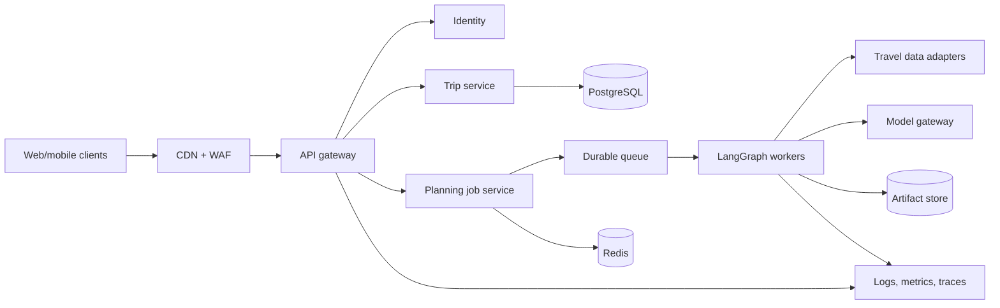

# 10. Interview and Extension Guide

## 1. Two-minute project explanation

TripMate AI is an offline-first travel-planning PWA with an optional agentic backend. The deployed frontend works without a build step or API key: it creates bounded itineraries from structured destination profiles, stores trips locally, shows budget and map views, exports JSON, and caches its shell for offline use.

The optional backend uses FastAPI for typed HTTP contracts, LangGraph for a four-stage workflow, Groq for constrained research notes, and SQLAlchemy with SQLite or PostgreSQL for persistence. Research can use the model, while routing, budget allocation, and safety guidance remain deterministic. If the model key is absent or the provider fails, the graph records the fallback and still returns a valid plan.

The frontend deploys through GitHub Actions to GitHub Pages. The backend has Docker Compose for local PostgreSQL and a Render Blueprint for managed deployment. The key design principle is graceful degradation: infrastructure or model failure should reduce capability, not destroy the product.

## 2. Five-minute architecture walkthrough

Use this order in an interview:

1. **Problem:** itinerary quality requires constraints, not just attractive text.
2. **Client:** plain JavaScript state and local planner make the public app immediately usable.
3. **Offline:** manifest and service worker cache the shell; localStorage keeps trip data.
4. **API contract:** Pydantic validates bounded trip inputs before workflow execution.
5. **Orchestration:** LangGraph runs research -> route -> budget -> safety over typed state.
6. **Model boundary:** Groq is optional and only influences research notes.
7. **Persistence:** SQLAlchemy transaction scope stores complete plan payloads.
8. **Delivery:** Pages pipeline validates and publishes only public assets; Render describes the optional backend.
9. **Trade-offs:** browser is not connected yet, JSON persistence is flexible but weak for analytics, and routing uses templates rather than live geospatial tools.
10. **Next step:** add a typed API adapter, source-aware tools, authentication, migrations, tracing, and evaluations.

## 3. Why LangGraph instead of one prompt?

**Answer:** A single prompt mixes research, scheduling, budgeting, and safety into one untestable operation. LangGraph gives named nodes, explicit order, shared structured state, and a place to add branches, retries, persistence, and human approval. I can test deterministic nodes independently and constrain the model to the task where it adds value. The current graph is intentionally simple; it demonstrates orchestration without claiming autonomy it does not have.

## 4. Is this really multi-agent?

**Answer:** The backend has four role-specific graph nodes sharing state. Only the research node currently invokes an LLM; the other agents are deterministic domain functions. I describe it as a controlled multi-stage agentic workflow rather than four autonomous model agents. In the static UI, the four-agent overlay represents the same conceptual stages, but execution is one deterministic local function. Being precise about that difference is important.

## 5. Why keep deterministic logic?

**Answer:** Dates, activity counts, and budget totals are constraints that code can guarantee. Moving them into a model would add cost and variability while weakening tests. The model is better used for synthesis where multiple reasonable answers exist. This hybrid design gives flexible research plus reliable structural rules.

## 6. How does fallback work?

**Answer:** The research node builds conservative fallback notes before checking the model key. With no key, it returns them immediately. With a key, any import, timeout, provider, parsing, or shape error is caught and converted to the same fallback result. The trace records the mode and exception type. Route, budget, and safety nodes then run normally. The public client also has its own local planner, providing another level of resilience.

## 7. How do you prevent hallucinated travel facts?

**Answer:** The prompt explicitly rejects invented live prices, opening hours, and safety claims. Safety output tells users to re-verify volatile facts. More importantly, the current system does not claim real-time accuracy. A production version needs approved source tools, citations, timestamps, freshness policies, and validators. Prompt wording alone is not a factuality guarantee.

## 8. Explain the state graph

**Answer:** Invocation starts with a validated `TripRequest` and empty trace. Research adds notes and execution mode. Route adds dated itinerary days based on pace. Budget allocates the total across five categories. Safety adds verification and offline-readiness guidance. Each node returns partial updates that LangGraph merges. After the graph finishes, `plan_trip` maps final state to a validated `TripPlan` response.

## 9. Why FastAPI?

**Answer:** It makes Python type hints and Pydantic models the request/response contract, generates OpenAPI documentation, integrates cleanly with Uvicorn, and has a lightweight test client. It fits a model-orchestration service well. Framework choice is not the architecture by itself; validation boundaries, timeout policy, transaction lifecycle, and deployment behavior still need explicit design.

## 10. Why SQLAlchemy and PostgreSQL?

**Answer:** SQLAlchemy keeps engine, ORM, and transaction code portable between local SQLite and hosted PostgreSQL. PostgreSQL is the production direction because it handles concurrent writes, operational tooling, and durable managed storage better than SQLite. `pool_pre_ping` protects against stale pooled connections, and the session context manager guarantees commit, rollback, and close behavior.

## 11. Why store the plan as JSON?

**Answer:** It lets the plan shape evolve quickly and restores a complete document with one read. That is a good early-stage trade-off. The downside is weaker nested constraints, awkward analytics, and costly partial updates. If product requirements include querying activities, collaborative edits, or reporting, I would normalize key entities and retain a versioned snapshot for portability.

## 12. What transaction guarantees exist?

**Answer:** Each route enters a fresh SQLAlchemy session. On normal exit, pending changes commit. On exception, the session rolls back and the error propagates. The `finally` block always closes resources. That gives atomicity for operations in one request. There is no cross-service transaction, retry policy, or optimistic concurrency yet.

## 13. What is the PWA cache strategy?

**Answer:** Install precaches the shell. Activate deletes older named caches. GET requests use network first, cache successful responses, and use cached data when the network fails. The worker derives the base path from registration scope, which is necessary for GitHub Pages project URLs. A production version should restrict HTML fallback to navigations and avoid caching private API responses.

## 14. Why localStorage?

**Answer:** It is zero-dependency, persistent across reloads, and adequate for small device-local JSON. It is synchronous, origin-scoped, visible to page scripts, and unsuitable for large data or cross-device sync. IndexedDB would be the next offline storage step; server persistence plus a sync queue would support accounts and multiple devices.

## 15. How is XSS reduced?

**Answer:** Free-form values are escaped before entering template HTML. User data is treated as text, not markup. The current use of string templates and inline event handlers is still a limitation. I would move to event listeners, add a strict Content Security Policy, avoid arbitrary HTML rendering, and include automated payload tests.

## 16. Is CORS security?

**Answer:** CORS restricts which browser origins can read responses. It does not authenticate a caller, authorize access to trips, or stop direct HTTP clients. A production API needs authenticated identity and ownership checks for every trip operation, independently of CORS.

## 17. How are secrets managed?

**Answer:** The key is read only by the backend from `GROQ_API_KEY`. The example environment file contains no real secret, the actual `.env` is ignored, and the frontend test scans for obvious token prefixes. In production I would use the hosting platform's secret store, least privilege, rotation, provider quotas, CI secret scanning, and redacted structured logs.

## 18. How would you connect the frontend and backend?

**Answer:** I would add one API adapter responsible for base URL, request field conversion, response-to-view-model conversion, timeout, error classification, and schema version. Generation would try the API and fall back locally on recoverable failures. The UI would show model, server fallback, or local mode. Saving would use idempotency and an offline queue to avoid duplicates.

## 19. How would you scale plan generation?

**Answer:** First measure latency and concurrency. Model calls dominate, so I would add request deadlines, bounded retries, normalized request caching, and provider concurrency limits. Long workflows would become asynchronous jobs processed by workers. LangGraph state would use a durable checkpointer. Stateless API replicas would sit behind a load balancer, while PostgreSQL and Redis would provide durable and short-lived shared state.

## 20. How would you add authentication?

**Answer:** Use an established OIDC provider. The browser obtains a short-lived access token; the API verifies issuer, audience, signature, expiry, and scopes. Every trip row gets a user or tenant owner. Queries include ownership in the database predicate instead of fetching first and checking later. Refresh/session handling, CSRF behavior, logout, account deletion, and audit events need explicit design.

## 21. How would you make route planning real?

**Answer:** Research would produce sourced candidate place ids. A geocoder resolves coordinates, and a route-matrix provider returns time and distance by travel mode. An optimizer would cluster places under opening-window, pace, accessibility, and daily-time constraints. The plan would retain provider, timestamp, and confidence, and it would degrade to neighborhood grouping when routing is unavailable.

## 22. How would you evaluate output quality?

**Answer:** I would build a versioned evaluation set across destinations, trip lengths, budgets, accessibility needs, and adversarial notes. Deterministic checks would score dates, budget, duplicates, schema, and unsupported live claims. Human rubrics would score coherence, relevance, feasibility, and explanation. I would compare model/prompt versions on quality, p95 latency, fallback rate, tokens, and cost before release.

## 23. What would you monitor?

**Answer:** API status and latency, graph node duration, generation success by mode, fallback reasons, provider errors and rate limits, token/cost usage, database errors and pool pressure, deployment version, offline installation failures, and user outcome metrics such as accepted activities. Logs would carry request ids but exclude raw sensitive notes and secrets.

## 24. What are the largest current weaknesses?

**Answer:** The deployed browser is not yet calling the backend. The route agent uses generic templates rather than research or geospatial data. API nested outputs use generic dictionaries. There is no authentication, migrations, pagination, durable graph state, or production observability. The service worker's generic fallback is too broad. Naming those limits shows where engineering effort should go next.

## 25. What are you most proud of?

**Answer:** The no-key path is a complete product rather than a broken placeholder. The system separates flexible model work from deterministic constraints, reports execution mode, and keeps secrets server-side. The deployment artifact is minimal and validated. Those choices make the project demonstrable even when external infrastructure is unavailable.

## 26. Production extension roadmap

### Phase 1: connect and harden

- typed browser API adapter;
- explicit loading/error/mode UI;
- nested Pydantic models;
- CRUD tests and isolated temporary database;
- better service-worker navigation handling;
- content security headers;
- Alembic migrations.

### Phase 2: user-ready

- OIDC authentication and trip ownership;
- IndexedDB offline queue and server synchronization;
- idempotent writes and optimistic concurrency;
- pagination, data export, and deletion;
- structured logs, metrics, traces, and alerts;
- lock files and dependency scanning.

### Phase 3: travel intelligence

- approved place, weather, advisory, and route tools;
- source citations and freshness policy;
- constraint critic and bounded revision;
- human approval checkpoints;
- model evaluation suite and release thresholds;
- multilingual and accessibility preferences.

### Phase 4: scale

- asynchronous planning jobs;
- durable LangGraph checkpointer;
- Redis caching and rate limiting;
- horizontally scaled API/workers;
- provider failover and cost controls;
- disaster recovery drills.

## 27. Whiteboard architecture prompt

For "design TripMate for one million users," clarify:

- daily and peak plan requests;
- synchronous latency target;
- percentage using live tools;
- collaboration requirements;
- geographic and data-residency needs;
- consistency needs for edits;
- acceptable stale-data windows;
- model budget and provider limits.

Then draw:

Discuss idempotency, backpressure, provider quotas, source freshness, privacy, and degraded modes before choosing individual technologies.

## 28. Resume bullets grounded in the implementation

- Built an offline-first travel-planning PWA with multi-trip state, itinerary editing, budget visualization, map context, JSON export, responsive navigation, and service-worker caching.
- Implemented a typed LangGraph workflow with research, route, budget, and safety stages, optional Groq inference, deterministic fallback, and inspectable execution traces.
- Developed a FastAPI and SQLAlchemy service supporting validated plan generation and transactional trip persistence across SQLite and PostgreSQL.
- Automated static validation and GitHub Pages delivery, and defined Docker Compose and Render infrastructure for the optional backend.

Only use claims you can demonstrate directly from the repository and live application.

